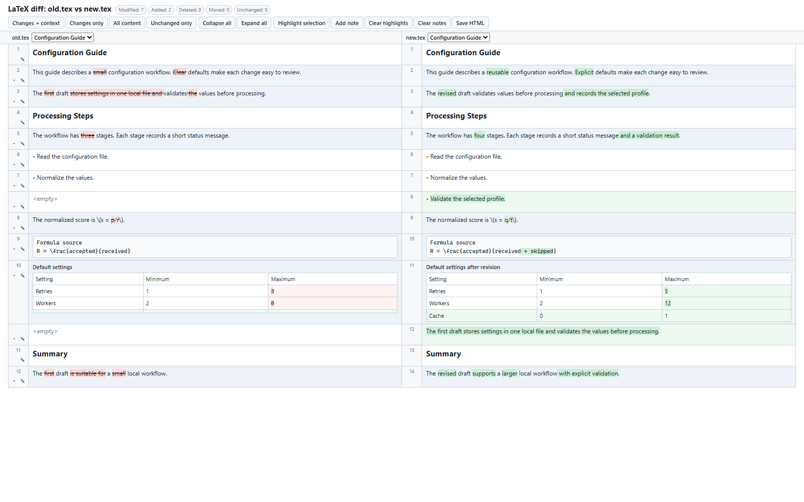
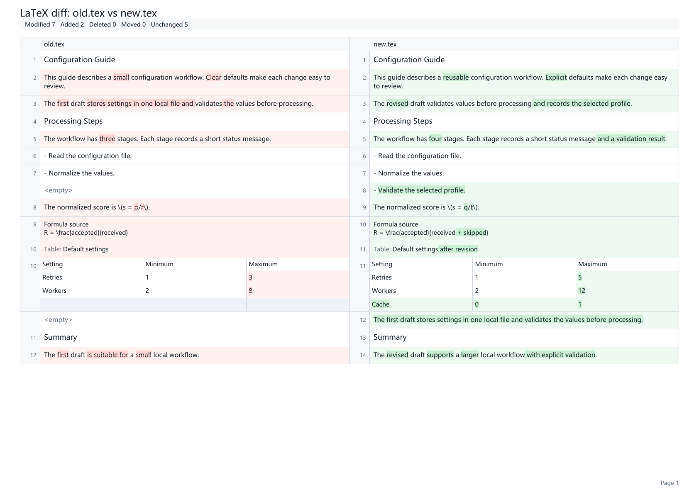

# texdiff

`texdiff` compares two LaTeX documents and produces a reviewable side-by-side report. It extracts headings, prose, lists, formulas, and simple tables before aligning their structure. The output is a self-contained HTML file and, when requested, a native ReportLab PDF.

## Highlights

- Compare local `.tex` files or two Git revisions.
- Expand local `\input` and `\include` files within the allowed source boundary.
- Align document blocks and identify modified, added, deleted, and moved content.
- Show word-level changes in prose and cell-level changes in simple tables.
- Keep inline and display formula source visible in the report.
- Ignore figures and image contents instead of attempting to process binary assets.
- Generate HTML without a server, CDN, remote font, or network request.
- Generate PDF with ReportLab as the default backend.
- Export a JSON summary for scripts and build checks.

## Installation

Python 3.10 or newer is required.

```bash
python -m venv .venv
source .venv/bin/activate
python -m pip install -e .
texdiff --doctor
```

On Windows PowerShell, activate the environment with:

```powershell
.\.venv\Scripts\Activate.ps1
```

The default installation uses ReportLab for PDF output and RapidFuzz for block matching. Optional browser and WeasyPrint backends are available through the extras declared in `pyproject.toml`.

## Quick Start

Compare two local files:

```bash
texdiff examples/old.tex examples/new.tex -o changes.pdf
```

This writes `changes.pdf` and `changes.html`. To write only HTML:

```bash
texdiff examples/old.tex examples/new.tex -o changes.html
```

Useful options:

```bash
texdiff old.tex new.tex --extractor builtin -o changes.pdf
texdiff old.tex new.tex --math keep --json-summary changes.json -o changes.pdf
texdiff old.tex new.tex --include-unchanged-in-pdf -o complete.pdf
```

Use `texdiff --help` for the complete option list.

## Git Revisions

Compare a tracked file from two revisions without checking either revision out:

```bash
texdiff \
  --repo . \
  --git-file docs/guide.tex \
  --old-commit HEAD~1 \
  --new-commit HEAD \
  -o revision-diff.pdf
```

Git mode reads `\input` and `\include` children from their matching revisions. Paths remain inside the repository root.

## Report Output

The HTML report is a single portable file. It includes filtering, section navigation, row folding, selection highlights, local notes, and annotated-copy export. Annotations stay in the browser until you explicitly save a copy.

The PDF uses a two-column landscape layout with separate old and new content. Formula source and table cells remain readable when a change is localized.

| Interactive HTML | Native PDF |
|:---:|:---:|
|  |  |

## Supported Structures

The built-in extractor recognizes:

- headings and section labels;
- paragraphs, list items, and quotes;
- inline and display formula source;
- simple `table`, `tabular`, `tabularx`, and `longtable` grids;
- raw fallback blocks for structures that cannot be simplified safely.

Figures, bibliography commands, citations, and references are filtered by default. The extractor does not compile TeX or evaluate arbitrary macros.

## Python API

```python
from texdiff import ExtractionOptions, generate_git_report, generate_report

report = generate_report(
    "old.tex",
    "new.tex",
    html_output="changes.html",
    pdf_output="changes.pdf",
    extraction=ExtractionOptions(extractor="builtin", math_mode="keep"),
)

print(report.stats.modified)

revision_report = generate_git_report(
    ".",
    "docs/guide.tex",
    "HEAD~1",
    "HEAD",
    html_output="revision.html",
    pdf_output=None,
)
```

## Development

Install development dependencies and run the repository checks:

```bash
python -m pip install -e ".[dev]"
make check
make benchmark
make demo
make build
```

`make check` compiles Python sources, checks the bundled JavaScript when Node.js is available, runs the test suite, and enforces the coverage threshold. `make benchmark` creates a deterministic structured input containing headings, prose, lists, formulas, tables, and several change types.

## Limitations

- TeX macro expansion is intentionally limited.
- Formula output shows source rather than final typeset mathematics.
- Complex tables receive best-effort parsing and may use a raw source fallback.
- Large reorderings use heuristic move detection.
- Local child-file expansion accepts UTF-8 files inside the source boundary.
- Git child-file expansion accepts repository-relative paths only.

## Security

`texdiff` treats input as text. It does not compile or execute document content. Local and Git child-file expansion is restricted to the relevant directory or repository root. Generated HTML escapes document text and embeds its assets locally.

Please report suspected path traversal, unsafe HTML serialization, or command execution issues privately before public disclosure. See [SECURITY.md](SECURITY.md).

## License

MIT License. Copyright (c) 2026 vzionv.
